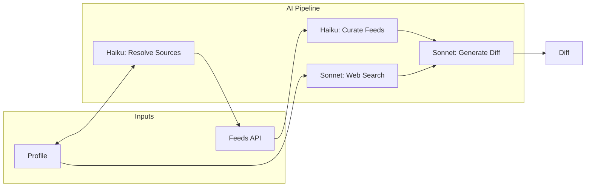

# AI Pipeline

diff·log uses multiple Claude models at different stages to generate personalized diffs. All API calls are made directly from the browser using the user's API key.

## Overview



## Models Used

| Stage | Model | Purpose |
|-------|-------|---------|
| Source Resolution | `claude-haiku-4-5` | Map custom items to feed sources |
| Feed Curation | `claude-haiku-4-5` | Filter general feeds for relevance |
| Web Search | `claude-sonnet-4-5` | Find recent news via `web_search` tool |
| Diff Generation | `claude-sonnet-4-5` | Generate the final diff |

## Depth Levels

Users select a reading depth that controls how detailed the generated diff will be:

| Level | ID | Prompt Instruction |
|-------|----|--------------------|
| Quick Scan | `quick` | 1-2 bullet points per section max. Headlines and key facts only. |
| Standard Brief | `standard` | 2-4 bullet points per section with key details and context. |
| Deep Dive | `deep` | Comprehensive analysis with background context and implications. |

The depth is passed to the generation prompt via `DEPTH_INSTRUCTIONS` in `src/lib/prompt.ts`.

## Source Resolution

When users add custom languages, frameworks, tools, or topics not in the predefined mappings, Haiku resolves them to feed sources.

**Predefined mappings** exist in `src/lib/feeds.ts`:

- `LANGUAGE_SUBREDDITS` — e.g., `TypeScript → ['typescript']`
- `FRAMEWORK_SUBREDDITS` — e.g., `React → ['reactjs']`
- `TOOL_SUBREDDITS` — e.g., `Docker → ['docker']`
- `TOPIC_SUBREDDITS` — e.g., `AI/ML & LLMs → ['MachineLearning', 'LocalLLaMA']`

**Custom items** (anything not in these maps) are resolved via `resolveSourcesForItem()`:

```typescript
// Haiku returns structured sources via tool use
{
  subreddits: ['homelab', 'selfhosted'],
  lobstersTags: ['unix', 'devops'],
  devtoTags: ['homelab', 'selfhosted']
}
```

Resolved mappings are cached in `profile.resolvedMappings` to avoid repeated API calls.

## Feed Curation

General feeds (Hacker News, Lobsters) contain broad tech news. Before including them in the prompt, Haiku filters for relevance to the user's profile.

**Process** (`curateGeneralFeeds()` in `src/lib/feeds.ts`):

1. Format all HN + Lobsters items with indices
2. Send to Haiku with profile context
3. Haiku returns indices of relevant items via `select_relevant` tool
4. Only selected items are included in the prompt

This reduces noise while keeping important cross-cutting news (security alerts, major releases).

## Web Search

Sonnet searches the web for recent news relevant to the profile using the `web_search` tool.

**Process** (`searchWebForProfile()` in `src/lib/feeds.ts`):

1. Build search context from profile (technologies + topics)
2. Call Sonnet with `web_search_20250305` tool (max 5 searches)
3. Extract results in structured format: title, URL, snippet
4. Format as `WEB SEARCH RESULTS` section in prompt

Web search runs in parallel with feed fetching for performance.

## Diff Generation

The main generation combines all sources into a single prompt for Sonnet.

**Prompt structure** (`buildPrompt()` in `src/lib/prompt.ts`):

```
FORMAT instructions (link formatting, score display)
PROFILE (name, technologies, topics, custom focus)
DEPTH instruction
WEB SEARCH RESULTS (if available)
REAL-TIME FEED DATA (curated items with URLs)
SECTION GUIDANCE (suggested sections with emoji prefixes)
PREVIOUS DIFF (to avoid repetition)
```

**Output** via `submit_diff` tool:

- `title` — Short creative title (3-8 words)
- `content` — Full markdown starting with date line

## Intelligence Window

The time window adapts to when the user last generated a diff:

- **No previous diff**: 7 days
- **Recent diff**: Days since last diff (clamped 1-7)

This is displayed as "Intelligence Window: Past N days" in the diff header.

## Cost Estimate

Typical costs per diff (varies with depth and content):

- Source resolution: ~$0.001 per custom item (Haiku)
- Feed curation: ~$0.002 (Haiku)
- Web search: ~$0.01-0.02 (Sonnet with search)
- Generation: ~$0.03-0.05 (Sonnet)

**Total: ~$0.05/diff** for standard depth with web search enabled.
