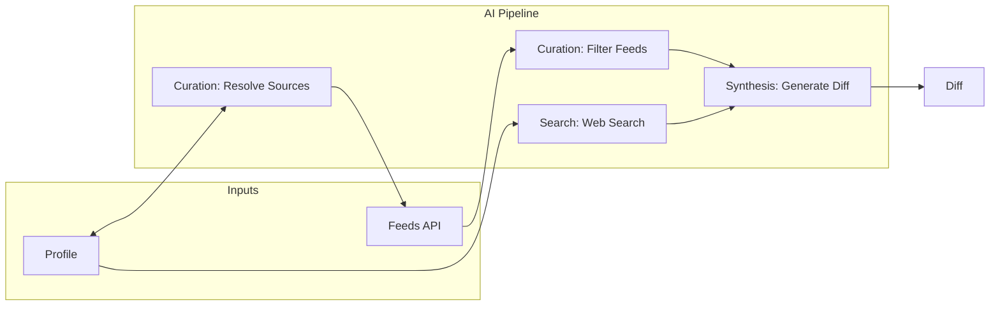

# AI Pipeline

diff·log uses a multi-step AI pipeline to generate personalized diffs. Each step can be powered by a different provider, and all API calls are made directly from the browser using the user's own keys.

## Providers

| Provider | Search | Curation | Synthesis | Model(s) |
|----------|:------:|:--------:|:---------:|----------|
| **Anthropic** | ✓ | ✓ | ✓ | Haiku 4.5 (curation), Sonnet 4.5 (search/synthesis) |
| **Serper** | ✓ | | | Google News API |
| **Perplexity** | ✓ | | ✓ | Sonar (search), Sonar Pro (synthesis) |
| **DeepSeek** | | ✓ | ✓ | DeepSeek Chat |
| **Gemini** | | ✓ | ✓ | Gemini 2.5 Flash |

Users configure API keys for one or more providers, then assign a provider to each pipeline step. Curation and synthesis require a provider; search is optional.

## Overview



## Pipeline Steps

### 1. Source Resolution (curation provider)

When users add custom languages, frameworks, tools, or topics not in the predefined mappings, the curation provider resolves them to feed sources.

**Predefined mappings** exist in `src/lib/utils/feeds.ts`:

- `LANGUAGE_SUBREDDITS` — e.g., `TypeScript → ['typescript']`
- `FRAMEWORK_SUBREDDITS` — e.g., `React → ['reactjs']`
- `TOOL_SUBREDDITS` — e.g., `Docker → ['docker']`
- `TOPIC_SUBREDDITS` — e.g., `AI/ML & LLMs → ['MachineLearning', 'LocalLLaMA']`

**Custom items** (anything not in these maps) are resolved via `resolveSourcesForItem()`:

```typescript
// Returns structured sources via JSON
{
  subreddits: ['homelab', 'selfhosted'],
  lobstersTags: ['unix', 'devops'],
  devtoTags: ['homelab', 'selfhosted']
}
```

Resolved mappings are cached in `profile.resolvedMappings` to avoid repeated API calls.

**Provider fallback** for curation tasks: DeepSeek → Gemini → Anthropic Haiku (cheapest available is preferred).

### 2. Feed Curation (curation provider)

General feeds (Hacker News, Lobsters) contain broad tech news. Before including them in the prompt, the curation provider filters for relevance to the user's profile.

**Process** (`curateGeneralFeeds()` in `src/lib/utils/feeds.ts`):

1. Format all HN + Lobsters items with indices
2. Send to curation provider with profile context
3. Provider returns indices of relevant items
4. Only selected items are included in the prompt

This reduces noise while keeping important cross-cutting news (security alerts, major releases).

### 3. Web Search (search provider, optional)

The search provider finds recent news relevant to the user's profile.

**Provider priority:** Serper → Perplexity → Anthropic (cheapest first).

| Provider | Method | Notes |
|----------|--------|-------|
| **Serper** | Google News API queries | Cheapest (~$0.001/request). Builds targeted queries from profile. |
| **Perplexity** | Sonar model with built-in search | Mid-tier. Has native web search capability. |
| **Anthropic** | Sonnet with `web_search` tool | Most expensive. Uses Claude's web search tool (max 5 searches). |

**Process** (`searchWeb()` in `src/lib/utils/search.ts`):

1. Build search context from profile (technologies + topics)
2. Execute searches via the selected provider
3. Extract results in structured format: title, URL, snippet
4. Format as `WEB SEARCH RESULTS` section in prompt

Web search runs in parallel with feed fetching for performance.

### 4. Diff Synthesis (synthesis provider)

The main generation combines all sources into a single prompt for the selected synthesis provider.

| Provider | Model | Cost (per 1M tokens) |
|----------|-------|---------------------|
| **DeepSeek** | `deepseek-chat` | $0.14 input / $0.28 output |
| **Gemini** | `gemini-2.5-flash` | $0.15 input / $0.60 output |
| **Anthropic** | `claude-sonnet-4-5` | $3 input / $15 output |
| **Perplexity** | `sonar-pro` | $3 input / $15 output |

Anthropic uses structured output via `tool_choice` (`submit_diff` tool). Other providers use plain text output with system instructions and a title extracted from the first `##` heading.

**Prompt structure** (`buildPrompt()` in `src/lib/utils/prompt.ts`):

```
FORMAT instructions (link formatting, score display)
PROFILE (name, technologies, topics, custom focus)
DEPTH instruction
WEB SEARCH RESULTS (if available)
REAL-TIME FEED DATA (curated items with URLs)
SECTION GUIDANCE (suggested sections with emoji prefixes)
PREVIOUS DIFF (to avoid repetition)
```

**Output:**

- `title` — Short creative title (3-8 words)
- `content` — Full markdown starting with date line
- `cost` — Estimated cost based on token usage

## Depth Levels

Users select a reading depth that controls how detailed the generated diff will be:

| Level | ID | Prompt Instruction |
|-------|----|--------------------|
| Quick Scan | `quick` | 1-2 bullet points per section max. Headlines and key facts only. |
| Standard Brief | `standard` | 2-4 bullet points per section with key details and context. |
| Deep Dive | `deep` | Comprehensive analysis with background context and implications. |

The depth is passed to the generation prompt via `DEPTH_INSTRUCTIONS` in `src/lib/utils/prompt.ts`.

## Intelligence Window

The time window adapts to when the user last generated a diff:

- **No previous diff**: 7 days
- **Recent diff**: Days since last diff (clamped 1-7)

This is displayed as "Intelligence Window: Past N days" in the diff header.

## Cost Estimates

Costs vary significantly by provider selection. Estimated costs per diff at standard depth:

| Configuration | Search | Curation | Synthesis | Total |
|--------------|--------|----------|-----------|-------|
| **Budget** (Serper + DeepSeek) | ~$0.005 | ~$0.0001 | ~$0.001 | **~$0.006** |
| **Mid-range** (Serper + Gemini) | ~$0.005 | ~$0.0001 | ~$0.002 | **~$0.007** |
| **Anthropic-only** | ~$0.01-0.02 | ~$0.002 | ~$0.03-0.05 | **~$0.05** |
| **No search** (DeepSeek) | — | ~$0.0001 | ~$0.001 | **~$0.001** |
