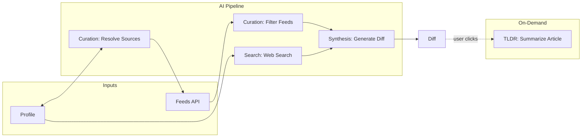

# AI Pipeline

diff·log uses a multi-step AI pipeline to generate personalized diffs. Each step can be powered by a different provider, and all API calls are made directly from the browser using the user's own keys.

## Providers

| Provider | Search | Curation | Synthesis | Default model(s) |
|----------|:------:|:--------:|:---------:|------------------|
| **Anthropic** | ✓ | ✓ | ✓ | Haiku 4.5 (curation), Sonnet 4.6 (search + synthesis); Opus 4.7 selectable for synthesis |
| **Serper** | ✓ | | | Google News API |
| **Perplexity** | ✓ | | ✓ | Sonar (search), Sonar Pro (synthesis); Sonar Reasoning Pro selectable |
| **DeepSeek** | | ✓ | ✓ | V4 Flash (default); V4 Pro selectable for synthesis |
| **Gemini** | | ✓ | ✓ | 3.1 Flash Lite (default); 3 Flash and 3.1 Pro selectable |

Users configure API keys for one or more providers, then assign a provider to each pipeline step. Curation and synthesis require a provider; search is optional. Per-step models can be picked from the provider's API key modal; defaults are marked in `src/lib/utils/providers.ts`.

## Overview


```mermaid
graph LR
    subgraph Inputs
        P[Profile]
        F[Feeds API]
    end

    subgraph "AI Pipeline"
        H1[Curation: Resolve Sources]
        H2[Curation: Filter Feeds]
        S1[Search: Web Search]
        S2[Synthesis: Generate Diff]
    end

    subgraph "On-Demand"
        T[TLDR: Summarize Article]
    end

    P <--> H1
    H1 --> F
    F --> H2
    P --> S1
    H2 --> S2
    S1 --> S2
    S2 --> D[Diff]
    D -.->|user clicks| T
```

## Pipeline Steps

### 1. Source Resolution (curation provider)

When users add custom languages, frameworks, tools, or topics not in the predefined mappings, the curation provider resolves them to feed sources.

**Predefined mappings** exist in `src/lib/utils/feeds.ts`:

- `LANGUAGE_SUBREDDITS` — e.g., `TypeScript → ['typescript']`
- `FRAMEWORK_SUBREDDITS` — e.g., `React → ['reactjs']`
- `TOOL_SUBREDDITS` — e.g., `Docker → ['docker']`
- `TOPIC_SUBREDDITS` — e.g., `AI/ML & LLMs → ['MachineLearning', 'LocalLLaMA']`

**Custom items** (anything not in these maps) are resolved via `resolveSourcesForItem()`:

```typescript
// Returns structured sources via JSON
{
  subreddits: ['homelab', 'selfhosted'],
  lobstersTags: ['unix', 'devops'],
  devtoTags: ['homelab', 'selfhosted']
}
```

Resolved mappings are cached in `profile.resolvedMappings` to avoid repeated API calls.

**Provider fallback** for curation tasks: DeepSeek → Gemini → Anthropic Haiku (cheapest available is preferred).

### 2. Feed Curation (curation provider)

General feeds (Hacker News, Lobsters) contain broad tech news. Before including them in the prompt, the curation provider filters for relevance to the user's profile.

**Process** (`curateGeneralFeeds()` in `src/lib/utils/feeds.ts`):

1. Format all HN + Lobsters items with indices
2. Send to curation provider with profile context
3. Provider returns indices of relevant items
4. Only selected items are included in the prompt

This reduces noise while keeping important cross-cutting news (security alerts, major releases).

### 3. Web Search (search provider, optional)

The search provider finds recent news relevant to the user's profile.

**Provider priority:** Serper → Perplexity → Anthropic (cheapest first).

| Provider | Method | Notes |
|----------|--------|-------|
| **Serper** | Google News API queries | Cheapest (~$0.001/request). Builds targeted queries from profile. Time window mapped to `qdr:d/w/m` based on intelligence window. |
| **Perplexity** | Sonar model with built-in search | Mid-tier. Has native web search capability. |
| **Anthropic** | Sonnet 4.6 with `web_search` tool | Most expensive. Uses Claude's web search tool (max 5 searches). |

**Process** (`searchWeb()` in `src/lib/utils/search.ts`):

1. Build search context from profile (technologies + topics)
2. Execute searches via the selected provider
3. Extract results in structured format: title, URL, snippet
4. Format as `WEB SEARCH RESULTS` section in prompt

Web search runs in parallel with feed fetching for performance.

### 4. Diff Synthesis (synthesis provider)

The main generation combines all sources into a single prompt for the selected synthesis provider.

| Provider | Default model | Cost (per 1M tokens) |
|----------|---------------|---------------------|
| **DeepSeek** | `deepseek-v4-flash` | $0.14 input / $0.28 output (V4 Flash); V4 Pro priced separately |
| **Gemini** | `gemini-3.1-flash-lite` | $0.25 input / $1.50 output |
| **Anthropic** | `claude-sonnet-4-6` | $3 input / $15 output (Opus 4.7 is higher; see `llm.ts`) |
| **Perplexity** | `sonar-pro` | $3 input / $15 output |

Anthropic synthesis uses structured output via `tool_choice` (`submit_diff` tool, `llm.ts:359`). The generic JSON helper `completeJson` uses a separate `submit_result` tool for non-synthesis structured calls (curation, source resolution, TLDR). Other providers use plain text output with system instructions and a title extracted from the first `##` heading.

**Prompt structure** (`buildPrompt()` in `src/lib/utils/prompt.ts`) — split between system and user messages:

```
System message:
  FORMAT instructions (link formatting, score display)
  SECTION GUIDANCE (suggested sections with emoji prefixes)

User message:
  PROFILE (name, technologies, topics, custom focus)
  DEPTH instruction
  WEB SEARCH RESULTS (if available)
  REAL-TIME FEED DATA (curated items with URLs)
  Sources note (no fabrication)
  PREVIOUS DIFF (to avoid repetition)
```

**Output** from the synthesis call: `{ title, content, cost }`. `generateDiff.ts` wraps that into the stored `Diff` record by attaching `id`, `generated_at`, `duration_seconds`, and `window_days`.

### 5. TLDR Summaries (synthesis provider preferred, on-demand)

When a user clicks the TLDR button on a paragraph, the app fetches the linked article and generates a context-aware summary. `summarizeArticle` passes the paragraph's recorded `provider` (the synthesis provider that wrote it) to `completeJson` as the preferred provider; the fallback chain (DeepSeek → Gemini → Anthropic Haiku) is the same as curation if that provider isn't configured.

**Article fetching** (`fetchArticleText()` in `src/lib/utils/tldr.ts`):

1. Try [Jina Reader](https://r.jina.ai/) — free extraction service that returns clean text/markdown
2. Fall back to `/api/fetch-article` — server-side fetch via Cloudflare worker that strips HTML
3. Validate content is real (min 200 chars, no CAPTCHA/login markers)
4. Truncate to ~4000 chars to keep LLM costs low

**Summarization** (`summarizeArticle()` in `src/lib/utils/tldr.ts`):

The prompt includes the paragraph's existing one-liner so the LLM adds depth rather than repeating it. The summary targets 4-6 short paragraphs with concrete details — version numbers, metrics, technical implications.

**Caching**: Summaries are stored in `localStorage` (`difflog-tldrs`) keyed by `profileId → diffId:pIndex`. Cached TLDRs show a persistent gold button. Not synced to the server — local-only, cheap to regenerate.

**Cost**: Same as curation tasks (uses `completeJson` with 768 max tokens). Roughly $0.0001-0.002 per TLDR depending on provider.

## Depth Levels

Users select a reading depth that controls how detailed the generated diff will be:

| Level | ID | Prompt Instruction |
|-------|----|--------------------|
| Quick Scan | `quick` | Max 3 sections, 1-2 bullet points each. Headlines and key facts only. Target ~500 words total. |
| Standard Brief | `standard` | 2-4 bullet points per section with key details and context. |
| Deep Dive | `deep` | Comprehensive analysis with background context, implications, and detail per item. |

The depth is passed to the generation prompt via `DEPTH_INSTRUCTIONS` in `src/lib/utils/prompt.ts`.

## Intelligence Window

The time window adapts to when the user last generated a diff:

- **No previous diff**: 7 days
- **Recent diff**: Days since last diff (clamped 1-7)

This is displayed as "Intelligence Window: Past N days" in the diff header.

## Cost Estimates

Costs vary significantly by provider selection. Estimated costs per diff at standard depth:

| Configuration | Search | Curation | Synthesis | Total |
|--------------|--------|----------|-----------|-------|
| **Budget** (Serper + DeepSeek) | ~$0.005 | ~$0.0001 | ~$0.001 | **~$0.006** |
| **Mid-range** (Serper + Gemini) | ~$0.005 | ~$0.0001 | ~$0.002 | **~$0.007** |
| **Anthropic-only** | ~$0.01-0.02 | ~$0.002 | ~$0.03-0.05 | **~$0.05** |
| **No search** (DeepSeek) | — | ~$0.0001 | ~$0.001 | **~$0.001** |
