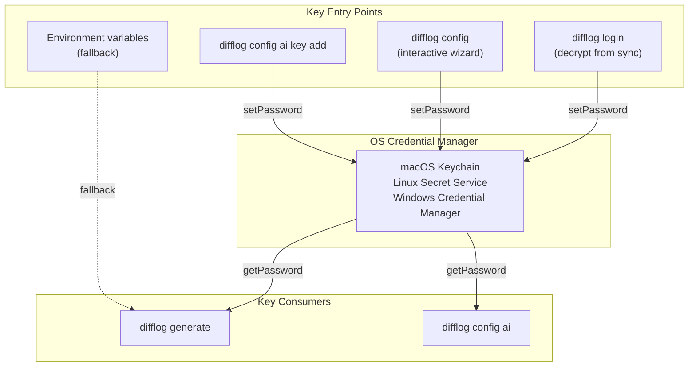

# CLI Key Storage Architecture

The CLI stores API keys in the operating system's native credential manager via the [`cross-keychain`](https://github.com/magarcia/cross-keychain) library. Keys are never written to disk as plaintext. The service name (`difflog-cli`) is defined in `src/cli/ui.ts` and the provider list (`PROVIDER_IDS`) comes from `src/lib/utils/providers.ts`, shared with the web app.

## Overview



## Storage Details

### Service & Account Names

All keys are stored under a single service name with the provider as the account:

| Field | Value |
|-------|-------|
| **Service** | `difflog-cli` |
| **Account** | Provider name: `anthropic`, `serper`, `perplexity`, `deepseek`, `gemini` |
| **Secret** | Raw API key string |

### Platform Backends

| Platform | Backend | Lookup |
|----------|---------|--------|
| **macOS** | Keychain Access | Search for service "difflog-cli" |
| **Linux** | Secret Service API (GNOME Keyring / KDE Wallet) | Seahorse or `secret-tool lookup service difflog-cli` |
| **Windows** | Credential Manager | Control Panel → Credential Manager, search "difflog-cli" |

### cross-keychain API

The CLI uses three functions from `cross-keychain`, with the service name and provider list defined in shared modules:

```typescript
import { getPassword, setPassword, deletePassword } from 'cross-keychain';
import { SERVICE_NAME } from './ui';           // 'difflog-cli'
import { PROVIDER_IDS } from '../lib/utils/providers'; // ['anthropic', 'serper', ...]

// Store a key
await setPassword(SERVICE_NAME, 'anthropic', 'sk-ant-...');

// Retrieve a key
const key = await getPassword(SERVICE_NAME, 'anthropic');

// Delete a key
await deletePassword(SERVICE_NAME, 'anthropic');
```

Each call maps directly to the platform's native credential API — no intermediate encryption or wrapping.

## Key Lifecycle

### 1. Entry via Config Wizard

The interactive wizard (`src/cli/commands/config/interactive.ts`) lets users add/edit/remove keys per provider:

1. User navigates to a provider row and presses Enter
2. Wizard shows provider capabilities (search/curation/synthesis) and a link to get an API key
3. User enters the key (or types "remove" to delete)
4. Key is stored immediately via `setPassword`
5. If a new key is added, the wizard auto-selects the provider for any unconfigured pipeline steps

### 2. Entry via CLI Command

```bash
difflog config ai key add anthropic sk-ant-api03-...
difflog config ai key rm deepseek
```

Direct `setPassword` / `deletePassword` calls in `src/cli/commands/config/ai.ts`.

### 3. Entry via Login

When logging in from a shared profile (`difflog login`), the browser sends encrypted profile data including API keys. The CLI:

1. Decrypts the session payload (AES-256-GCM, see [CLI Login Architecture](cli-login.md))
2. Extracts API keys from the decrypted profile
3. Stores each key via `setPassword`

### 4. Retrieval During Generation

`difflog generate` (`src/cli/commands/generate.ts`) retrieves keys via `getApiKeys()` in `src/cli/config.ts`, which iterates over `PROVIDER_IDS` (from `src/lib/utils/providers.ts`) with an environment variable fallback:

```typescript
import { PROVIDER_IDS } from '../lib/utils/providers';
import { SERVICE_NAME } from './ui';

async function getApiKeys() {
    for (const provider of PROVIDER_IDS) {
        // 1. Try OS keychain first
        const keychainValue = await getPassword(SERVICE_NAME, provider);
        if (keychainValue) {
            keys[provider] = keychainValue;
        } else {
            // 2. Fall back to environment variable
            keys[provider] = process.env[`${provider.toUpperCase()}_API_KEY`];
        }
    }
}
```

The environment variable fallback (`ANTHROPIC_API_KEY`, `SERPER_API_KEY`, etc.) supports CI/CD and headless environments where the OS keychain may not be available.

### 5. Display in Config

`difflog config ai` checks which providers have keys configured (via `getPassword`) and displays a status grid — it never prints the actual key values.

## Security Properties

| Property | Detail |
|----------|--------|
| **No plaintext on disk** | Keys exist only in the OS credential store, not in any config file |
| **Process isolation** | OS credential managers restrict access to the calling application |
| **No key echo** | The interactive wizard and CLI commands never print key values back |
| **Scoped deletion** | Removing a key also clears any provider selections that depended on it |
| **Env var fallback** | For headless/CI environments where keychain is unavailable |

## File Locations

For reference, these are the CLI's on-disk files — **none contain API keys**:

| File | Contents |
|------|----------|
| `~/.config/difflog/session.json` | Profile ID, password salt |
| `~/.config/difflog/profile.json` | Name, languages, frameworks, topics, depth, provider selections |
| `~/.config/difflog/diffs.json` | Cached diff history |
| `~/.config/difflog/read-state.json` | Article read/unread tracking |

## Supported Providers

| Provider | Account Name | Capabilities | Key Prefix |
|----------|-------------|--------------|------------|
| Anthropic (Claude) | `anthropic` | search, curation, synthesis | `sk-ant-` |
| Serper | `serper` | search | — |
| Perplexity | `perplexity` | search, curation, synthesis | `pplx-` |
| DeepSeek | `deepseek` | curation, synthesis | `sk-` |
| Google Gemini | `gemini` | curation, synthesis | — |
