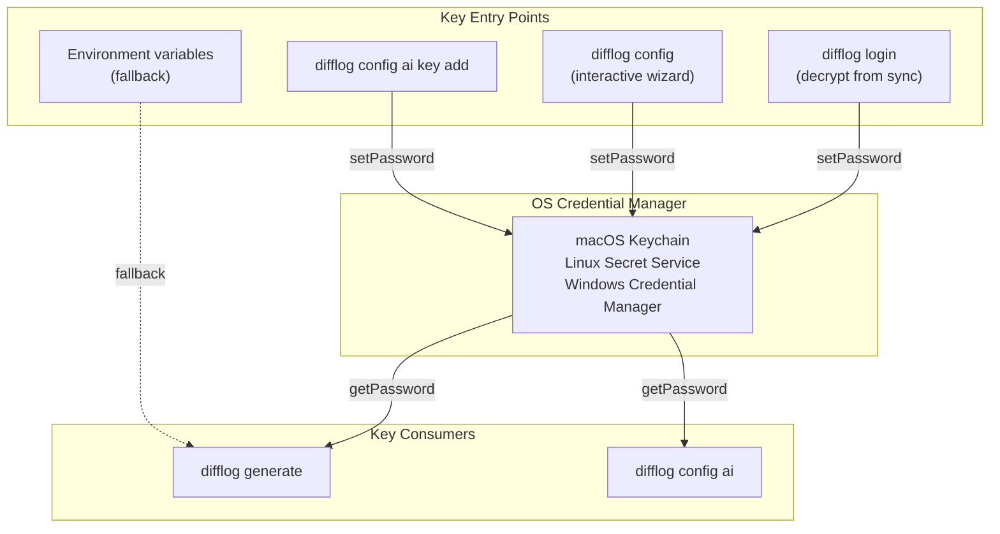

# CLI Key Storage Architecture

The CLI stores API keys in the operating system's native credential manager via the [`cross-keychain`](https://github.com/magarcia/cross-keychain) library. Keys are never written to disk as plaintext. The service name (`difflog-cli`) is defined in `src/cli/ui.ts` and the provider list (`PROVIDER_IDS`) comes from `src/lib/utils/providers.ts`, shared with the web app.

## Overview


```mermaid
graph TD
    subgraph "Key Entry Points"
        Login["difflog login<br/>(decrypt from sync)"]
        ConfigWizard["difflog config<br/>(interactive wizard)"]
        ConfigCLI["difflog config ai key add"]
        EnvVar["Environment variables<br/>(fallback)"]
    end

    subgraph "OS Credential Manager"
        Keychain["macOS Keychain<br/>Linux Secret Service<br/>Windows Credential Manager"]
    end

    subgraph "Key Consumers"
        Generate["difflog generate"]
        ConfigShow["difflog config ai"]
    end

    Login -->|setPassword| Keychain
    ConfigWizard -->|setPassword| Keychain
    ConfigCLI -->|setPassword| Keychain
    Keychain -->|getPassword| Generate
    Keychain -->|getPassword| ConfigShow
    EnvVar -.->|fallback| Generate
```

## Storage Details

### Service & Account Names

All keys are stored under a single service name with the provider as the account:

| Field | Value |
|-------|-------|
| **Service** | `difflog-cli` |
| **Account** | Provider name: `anthropic`, `serper`, `perplexity`, `deepseek`, `gemini` |
| **Secret** | Raw API key string |

### Platform Backends

| Platform | Backend | Lookup |
|----------|---------|--------|
| **macOS** | Keychain Access | Search for service "difflog-cli" |
| **Linux** | Secret Service API (GNOME Keyring / KDE Wallet) | Seahorse or `secret-tool lookup service difflog-cli` |
| **Windows** | Credential Manager | Control Panel → Credential Manager, search "difflog-cli" |

### cross-keychain API

The CLI uses three functions from `cross-keychain`, with the service name and provider list defined in shared modules:

```typescript
import { getPassword, setPassword, deletePassword } from 'cross-keychain';
import { SERVICE_NAME } from './ui';           // 'difflog-cli'
import { PROVIDER_IDS } from '../lib/utils/providers'; // ['anthropic', 'serper', ...]

// Store a key
await setPassword(SERVICE_NAME, 'anthropic', 'sk-ant-...');

// Retrieve a key
const key = await getPassword(SERVICE_NAME, 'anthropic');

// Delete a key
await deletePassword(SERVICE_NAME, 'anthropic');
```

Each call maps directly to the platform's native credential API — no intermediate encryption or wrapping.

## Key Lifecycle

### 1. Entry via Config Wizard

The interactive wizard (`src/cli/commands/config/interactive.ts`) lets users add/edit/remove keys per provider:

1. User navigates to a provider row and presses Enter
2. Wizard shows provider capabilities (search/curation/synthesis) and a link to get an API key
3. User enters the key (or types "remove" to delete)
4. Key is stored immediately via `setPassword`
5. If a new key is added, the wizard auto-selects the provider for any unconfigured pipeline steps

### 2. Entry via CLI Command

```bash
difflog config ai key add anthropic sk-ant-api03-...
difflog config ai key rm deepseek
```

Direct `setPassword` / `deletePassword` calls in `src/cli/commands/config/ai.ts`.

### 3. Entry via Login

`difflog login` does **not** receive API keys via the browser relay (the relay only carries an encrypted `{profileId}`). Instead, the CLI:

1. Decrypts the relay blob to recover the `profileId`
2. Prompts the user for the profile password in the terminal
3. Calls `importProfile(profileId, password)` against the standard sync API, which downloads the server-side encrypted keys blob and decrypts it locally
4. Stores each provider key via `setPassword(SERVICE_NAME, provider, key)`

The CLI is also tolerant of legacy keys-blob formats on download. `decryptKeysBlob` (in `src/lib/utils/sync-core.ts`) handles three shapes seen historically:

- `EncryptedKeysBlob` — `{ apiKeys, providerSelections }` (current format)
- `Record<string, string>` — raw map of provider → key
- A single string — interpreted as a bare Anthropic key for very early profiles

On download, the CLI merges new keys into the keychain additively (existing local keys are not deleted just because they're absent from the remote blob). See `src/cli/sync.ts`.

See [CLI Login Architecture](cli-login.md) for the full flow.

### 4. Retrieval During Generation

`difflog generate` retrieves keys via `getApiKeys()` in `src/cli/config.ts`. For each provider it tries the keychain first (wrapped in try/catch so a failing backend doesn't abort iteration), then falls back to an environment variable only when the keychain returned no value:

```typescript
async function getApiKeys(): Promise<Record<string, string>> {
    const keys: Record<string, string> = {};
    for (const provider of PROVIDER_IDS) {
        try {
            const key = await getPassword(SERVICE_NAME, provider);
            if (key) { keys[provider] = key; continue; }
        } catch { /* skip */ }
        const envVar = `${provider.toUpperCase()}_API_KEY`;
        if (process.env[envVar]) keys[provider] = process.env[envVar]!;
    }
    return keys;
}
```

The environment variable fallback (`ANTHROPIC_API_KEY`, `SERPER_API_KEY`, etc.) supports CI/CD and headless environments where the OS keychain may not be available.

### 5. Display in Config

`difflog config ai` checks which providers have keys configured (via `getPassword`) and displays a status grid — it never prints the actual key values.

## Security Properties

| Property | Detail |
|----------|--------|
| **No plaintext on disk** | Keys exist only in the OS credential store, not in any config file |
| **Process isolation** | OS credential managers restrict access to the calling application |
| **No key echo** | The interactive wizard and CLI commands never print key values back |
| **Scoped deletion** | `clearProviderSelections(provider)` clears any `providerSelections` entries pointing at that provider when its key is removed. **Note:** `modelSelections` are not currently cleared in the same pass, so re-adding a key may resurface a previously chosen model. |
| **Env var fallback** | For headless/CI environments where keychain is unavailable |

## File Locations

For reference, these are the CLI's on-disk files — **none contain API keys**:

| File | Contents |
|------|----------|
| `~/.config/difflog/session.json` | Profile ID, profile password (plaintext, mode 0600), password salt, content salt |
| `~/.config/difflog/profile.json` | Name, languages, frameworks, topics, depth, provider selections, model selections, resolved mappings, migration flags |
| `~/.config/difflog/diffs.json` | Cached diff history |
| `~/.config/difflog/read-state.json` | Article read/unread tracking |
| `~/.config/difflog/stars.json` | Starred (bookmarked) articles |
| `~/.config/difflog/pending.json` | Pending sync changes (modified/deleted IDs since last sync) |
| `~/.config/difflog/sync-meta.json` | Sync metadata: last server hashes, last sync timestamps |

!!! warning "Profile Password Stored in Plaintext"
    `session.json` keeps the user-typed profile password in plaintext (mode 0600) so background sync can resume without re-prompting. API keys themselves are still in the OS keychain, but anyone with read access to the home directory can recover the sync password and use it to decrypt the cloud-stored content.

## Supported Providers

| Provider | Account Name | Capabilities | Key Prefix |
|----------|-------------|--------------|------------|
| Anthropic (Claude) | `anthropic` | search, curation, synthesis | `sk-ant-` |
| Serper | `serper` | search | — |
| Perplexity | `perplexity` | search, curation, synthesis | `pplx-` |
| DeepSeek | `deepseek` | curation, synthesis | `sk-` |
| Google Gemini | `gemini` | curation, synthesis | — |
