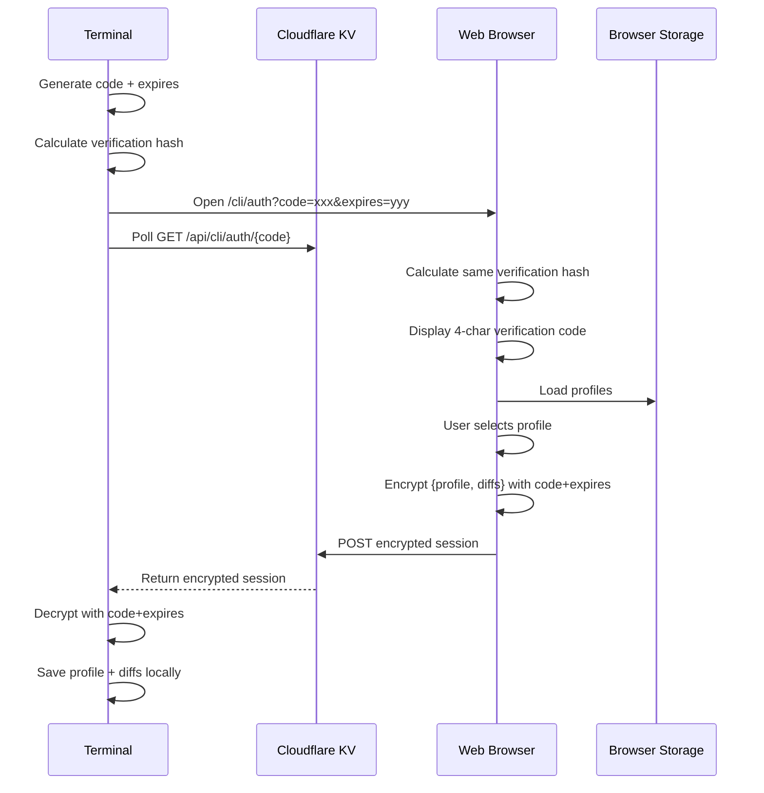
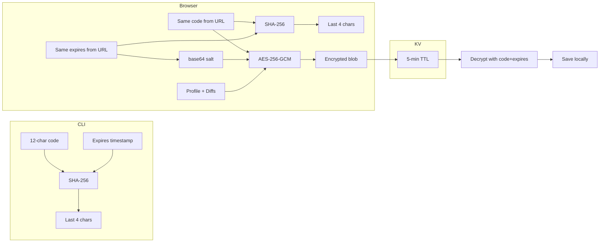

# CLI Login Architecture

The CLI login system enables web-assisted authentication similar to `gh auth login`, allowing users to authenticate in the terminal by completing the flow in their browser.

## Overview



## Components

### 1. CLI Command (`src/cli/commands/login.ts`)

The login command supports two modes:

**Interactive Web Login (default):**
```bash
difflog login
difflog login --no-browser  # print URL instead of opening
```

**Direct Login (legacy):**
```bash
difflog login --profile UUID --password PASSWORD
```

#### Web Login Flow

1. **Generate ephemeral credentials:**
   - Code: 12 random hex characters from UUID
   - Expires: current timestamp + 5 minutes
   - Verification code: last 4 chars of `SHA-256(code + expires)`

2. **Open browser:**
   - URL: `{BASE}/cli/auth?code={code}&expires={expires}`
   - Opens via `xdg-open` (Linux) or `open` (macOS)
   - Prints verification code to stderr for user confirmation

3. **Poll for session:**
   - GET `{BASE}/api/cli/auth/{code}` every 2 seconds
   - Timeout after 5 minutes
   - Shows spinner in terminal: `| / - \`

4. **Decrypt session:**
   - Receives encrypted blob from KV
   - Decrypts using code as password, expires as salt
   - Saves profile + diffs to local config

### 2. Browser Auth Page (`src/routes/cli/auth/+page.svelte`)

Multi-step SPA that guides users through authentication:

#### Step 1: Verification
- Calculates verification code: `SHA-256(code + expires).slice(-4)`
- User confirms code matches terminal
- Prevents MITM attacks by requiring out-of-band verification

#### Step 2: Profile Selection
- Loads profiles from localStorage
- Displays cards with profile name, ID, and type (Local/Shared)
- Auto-selects if only one profile exists

#### Step 3: Encryption & Upload
- Collects profile metadata + diff history
- Encrypts payload using:
  - Password: `code` (from URL)
  - Salt: `base64(expires)` (from URL)
- POSTs encrypted session to KV relay

#### Step 4: Redirect
- Redirects to `/cli/success` on successful upload
- Success page shows checkmark and "Profile sent to CLI"

### 3. KV Relay API (`src/routes/api/cli/auth/[code]/+server.ts`)

Temporary storage for encrypted session data using Cloudflare Workers KV.

#### GET Endpoint (CLI polls)

```typescript
GET /api/cli/auth/{code}
```

**Response:**
- `{pending: true}` - session not yet uploaded
- `{session: "..."}` - encrypted session blob (auto-deletes after read)

**Validation:**
- Code must match `/^[0-9a-f]{12}$/`
- Returns 400 if invalid

#### POST Endpoint (Browser uploads)

```typescript
POST /api/cli/auth/{code}
Body: {encrypted_session: string, expires: number}
```

**TTL Calculation:**
```typescript
const ttl = Math.min(300, Math.max(1, Math.ceil((expires - Date.now()) / 1000)));
```

- Respects client-provided expiry timestamp
- Capped at 5 minutes to prevent abuse
- KV auto-deletes after TTL

### 4. Shared Layout (`src/routes/cli/+layout.svelte`)

Common layout for all `/cli/*` routes:
- diff·log branding
- "CLI Login" subtitle
- Container styles (.cli-auth, .cli-card, etc.)
- Global styles for child pages

## Security Model

### Encryption Flow



### Security Properties

1. **End-to-end encryption**: Server never sees plaintext credentials
2. **Ephemeral keys**: Code and expires are single-use, auto-expire
3. **Tamper detection**: Verification code binds code+expires together
4. **No password transmission**: Profile data relayed directly, no server auth
5. **Time-bound**: All sessions expire in 5 minutes maximum

### Attack Resistance

| Attack | Mitigation |
|--------|-----------|
| Code interception | Verification code prevents MITM (requires out-of-band confirmation) |
| URL tampering | Changing expires invalidates verification code |
| Replay attack | KV entry deleted after first read |
| Brute force | Code is 12 hex chars (2^48 entropy), expires in 5 minutes |
| Server compromise | Only encrypted blobs stored, useless without code+expires |

## Data Flow

### Payload Structure

```typescript
interface RelayPayload {
  profile: {
    id: string;
    name: string;
    languages: string[];
    frameworks: string[];
    tools: string[];
    topics: string[];
    depth: 'quick' | 'standard' | 'deep';
    customFocus: string;
  };
  diffs: Diff[];
}
```

Diffs include full history from browser's localStorage. No server sync occurs during login.

### Encryption Details

- **Algorithm**: AES-256-GCM (same as standard encryption)
- **Key derivation**: PBKDF2 with 100,000 iterations
- **Password**: Raw code string (12 hex chars)
- **Salt**: `base64(TextEncoder.encode(String(expires)))`
- **IV**: Random 12 bytes prepended to ciphertext

### Local Storage

CLI stores decrypted data in `~/.config/difflog/` (Linux/macOS) or `%APPDATA%\difflog\` (Windows):

- `session.json` - Profile ID + credentials (if shared profile)
- `profile.json` - Profile metadata
- `diffs.json` - Diff history

API keys extracted during login are stored in the OS keychain — see [CLI Key Storage Architecture](cli-keys.md) for details.

## Environment Variables

- `DIFFLOG_URL`: Override base URL (default: `https://difflog.dev`)
  - Used for local development: `DIFFLOG_URL=http://localhost:8788`
  - CLI uses `localAwareFetch` for IPv6 fallback on localhost

## Implementation Notes

### Browser Compatibility

- Uses Web Crypto API (standard encryption)
- QR code generation via CDN (optional fallback)
- Works on mobile browsers for profile selection

### Terminal Compatibility

- Raw mode for interactive input (`process.stdin.setRawMode`)
- Supports non-TTY piped input
- Ctrl+C handling (exit code 130)
- Spinner animation only when TTY

### Cross-Platform

- `xdg-open` on Linux
- `open` on macOS
- Falls back gracefully if browser launch fails (prints URL)

## Monitoring & Debugging

### Successful Login

```
$ difflog login

  Verification code: a3f7

  Press Enter to open difflog.dev in your browser...

  | Waiting for browser login... done
  Logged in as John Doe. 42 diff(s) cached.
```

### Common Errors

**Connection failed:**
```
Error: Unable to connect to https://difflog.dev — fetch failed
```
- Check internet connection
- Verify DIFFLOG_URL if testing locally

**Timeout:**
```
Error: Login timed out. Run `difflog login` to try again.
```
- User took >5 minutes to complete browser flow
- Code expired in KV

**Invalid code:**
```
{"error": "Invalid code"}
```
- Malformed code in URL
- Code already consumed (replay attempt)

## Future Enhancements

- [ ] QR code in terminal (for remote SSH sessions)
- [ ] Device name labeling ("Logged in on MacBook Pro")
- [ ] Multiple profile selection for teams
- [ ] Biometric confirmation on mobile
- [ ] WebSocket for instant relay (remove polling)
