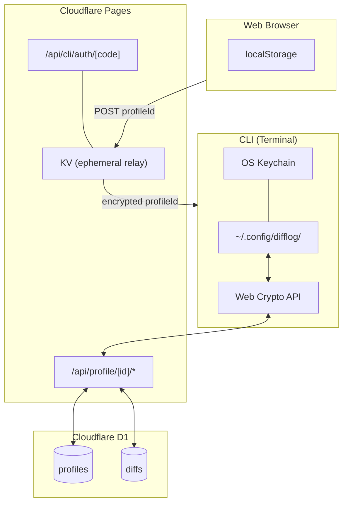
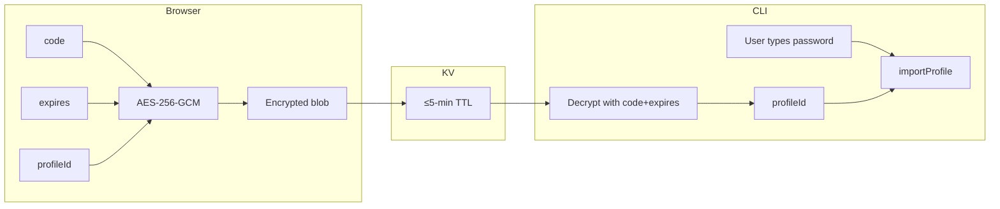

# CLI Login Architecture

The `difflog login` command authenticates a terminal by piggy-backing on a browser session — similar to `gh auth login`. The browser **does not** ship profile data to the CLI; it only relays a profile ID, after which the CLI authenticates against the regular sync API using a password the user types into the terminal.

## Architecture


``` mermaid
graph TB
    subgraph CLI ["CLI (Terminal)"]
        Config["~/.config/difflog/"]
        Keychain["OS Keychain"]
        Crypto[Web Crypto API]
    end

    subgraph Server ["Cloudflare Pages"]
        AuthAPI["/api/cli/auth/[code]"]
        SyncAPI["/api/profile/[id]/*"]
        KV["KV (ephemeral relay)"]
    end

    subgraph DB ["Cloudflare D1"]
        Profiles[(profiles)]
        Diffs[(diffs)]
    end

    subgraph Browser ["Web Browser"]
        Storage[localStorage]
    end

    Config <--> Crypto
    Keychain --- Config
    Crypto <--> SyncAPI
    SyncAPI <--> Profiles
    SyncAPI <--> Diffs
    Browser -- "POST profileId" --> KV
    KV -- "encrypted profileId" --> CLI
    AuthAPI --- KV
```

The CLI shares the same sync, encryption, and generation code as the web app. Profile metadata and diffs are stored as JSON files in `~/.config/difflog/`, while API keys are stored in the OS keychain.

## Login Flow

```mermaid
sequenceDiagram
    participant CLI as Terminal
    participant KV as Cloudflare KV
    participant Browser as Web Browser
    participant API as /api/profile/*

    CLI->>CLI: Generate code + expires
    CLI->>CLI: Calculate verification hash
    CLI->>Browser: Open /cli/auth?code=xxx&expires=yyy
    CLI->>KV: Poll GET /api/cli/auth/{code}

    Browser->>Browser: Show verification code (last 4 chars of SHA-256(code+expires))
    Browser->>Browser: User confirms code matches terminal
    Browser->>Browser: Load profiles from localStorage; user selects a SHARED profile
    Browser->>Browser: Encrypt {profileId} with code+expires
    Browser->>KV: POST encrypted blob

    KV-->>CLI: Return encrypted blob
    CLI->>CLI: Decrypt → profileId
    CLI->>CLI: Prompt user for profile password
    CLI->>API: importProfile(profileId, password)
    API-->>CLI: Profile + encrypted keys + diffs
    CLI->>CLI: Decrypt with password, store keys in keychain
```

## Components

### 1. CLI Command (`src/cli/commands/login.ts`)

The login command supports two modes:

**Interactive Web Login (default):**
```bash
difflog login
difflog login --no-browser  # print URL instead of opening
```

**Direct Login:**
```bash
difflog login --profile UUID [--password PASSWORD]
```

When `--password` is omitted, the CLI prompts for it. The browser flow also requires the user to type the profile password into the terminal once the relay returns.

#### Web Login Flow

1. **Generate ephemeral relay credentials:**
    - `code`: first 12 hex chars of a UUID (no dashes)
    - `expires`: `Date.now() + 5 minutes`
    - `verification`: last 4 hex chars of `SHA-256(code + expires)`

2. **Open browser:**
    - URL: `{BASE}/cli/auth?code={code}&expires={expires}`
    - `openUrl()` spawns `open` (macOS), `xdg-open` (Linux), or `cmd /c start` (Windows)
    - Prints verification code to stderr for user confirmation

3. **Poll relay:**
    - GET `{BASE}/api/cli/auth/{code}` every 2 seconds
    - Timeout after 5 minutes
    - Renders a spinner: `| / - \`

4. **Decrypt relay:**
    - Receives encrypted blob from KV
    - Decrypts with `code` (password) + `base64(String(expires))` (salt)
    - Plaintext is `{ profileId: string }` — nothing else

5. **Import via sync API:**
    - Prompt the user for the profile password in the terminal
    - Call `importProfile(profileId, password)` which exercises `GET /api/profile/{id}` and `GET /api/profile/{id}/content`
    - Decrypt the keys blob, store each provider key in the OS keychain with `setPassword(SERVICE_NAME, provider, key)`
    - Save session, profile (without keys), and diffs locally

### 2. Browser Auth Page (`src/routes/cli/auth/+page.svelte`)

Multi-step SPA that guides users through authentication:

#### Step 1: Verification
- Computes `SHA-256(code + expires).slice(-4)`
- User confirms the value matches their terminal — pure UX guard (no programmatic enforcement)

#### Step 2: Profile Selection
- Lists profiles from `localStorage`
- **Only profiles with a `passwordSalt` (i.e. shared profiles) are selectable.** Local-only cards are rendered disabled.
- If no profiles exist on the device, the page renders a QR code linking to the same URL plus a "Create a profile" link

#### Step 3: Relay Upload
- Builds the payload `{ profileId }` — no profile fields, no diffs, no keys
- Encrypts via `encryptData(payload, code, base64(String(expires)))`
- POSTs `{ encrypted_session, expires }` to `/api/cli/auth/{code}`
- Redirects to `/cli/success`

### 3. KV Relay API (`src/routes/api/cli/auth/[code]/+server.ts`)

Temporary storage for the encrypted `{profileId}` blob using Cloudflare KV.

#### GET (CLI polls)

```
GET /api/cli/auth/{code}
```

Response is one of:

- `{ "pending": true }` — session not yet uploaded
- `{ "session": "<base64 ciphertext>" }` — encrypted relay blob (deleted from KV after this read)

`code` must match `/^[0-9a-f]{12}$/`, otherwise 400.

#### POST (Browser uploads)

```
POST /api/cli/auth/{code}
{ "encrypted_session": "...", "expires": 1735689600000 }
```

KV TTL is clamped:

```typescript
const ttl = Math.min(300, Math.max(1, Math.ceil((expires - Date.now()) / 1000)));
```

- Capped at 5 minutes
- KV auto-deletes after TTL

### 4. Shared Layout (`src/routes/cli/+layout.svelte`)

Common layout for all `/cli/*` routes: branding, container styles, and a "CLI Login" subtitle.

## Security Model

### Encryption Flow

The relay channel encrypts only `{profileId}` — the profile password never traverses the relay. The user must type it into the terminal after the relay completes.


```mermaid
graph LR
    subgraph Browser
        PID[profileId]
        Code1[code]
        Exp1[expires]
        Code1 --> Encrypt[AES-256-GCM]
        Exp1 --> Encrypt
        PID --> Encrypt
        Encrypt --> Blob[Encrypted blob]
    end

    subgraph KV
        Blob --> Store[≤5-min TTL]
    end

    subgraph CLI
        Store --> Decrypt[Decrypt with code+expires]
        Decrypt --> Out[profileId]
        Prompt[User types password] --> Import
        Out --> Import[importProfile]
    end
```

### Security Properties

1. **Relay leaks nothing useful**: server only sees an encrypted `{profileId}`. Even if compromised, the relay payload reveals only a UUID — not credentials.
2. **Password still required**: profile content is fetched via the standard sync API, which requires the user's password (typed in the terminal).
3. **Ephemeral keys**: code and expires are single-use and TTL-bounded.
4. **Verification code**: out-of-band visual check; protects against phishing where the user is tricked into completing the wrong terminal's flow.

### Attack Resistance

| Attack | Mitigation |
|--------|-----------|
| Relay interception | Blob contains only an encrypted profile ID; attacker still needs the password and a fresh code+expires to decrypt |
| URL tampering | Changing `expires` invalidates the verification code and the AES salt |
| Replay attack | KV entry deleted on first GET |
| Brute force | Code is 12 hex chars (~2^48 entropy), expires in ≤5 minutes |
| Server compromise | Only encrypted relay blobs in KV; profile data still gated by sync API + password |

## Data Flow

### Relay Payload

```typescript
interface RelayPayload {
  profileId: string;
}
```

That is the entire payload. The CLI does the heavy lifting (`importProfile`) after the relay returns.

### Encryption Details

- **Algorithm**: AES-256-GCM (`encryptData` / `decryptData` from `src/lib/utils/crypto.ts`)
- **Key derivation**: PBKDF2 with 100,000 iterations
- **Password**: raw `code` string (12 hex chars)
- **Salt**: `base64(TextEncoder.encode(String(expires)))`
- **IV**: random 12 bytes prepended to ciphertext

### Local Storage

CLI stores data under `~/.config/difflog/` on every platform (Linux, macOS, and Windows alike — there is no `%APPDATA%` branch in `src/cli/config.ts`):

- `session.json` — `{ profileId, password, passwordSalt, salt }` (mode 0600; password is stored in plaintext for offline sync)
- `profile.json` — Profile metadata (API keys stripped before saving)
- `diffs.json` — Cached diff history
- `read-state.json`, `stars.json`, `pending.json`, `sync-meta.json` — local interactive viewer + sync state

API keys are extracted during `importProfile` and stored in the OS keychain via `cross-keychain`. See [CLI Key Storage](cli-keys.md).

## Environment Variables

- `DIFFLOG_URL`: Override base URL (default: `https://difflog.dev`)
    - Used for local development: `DIFFLOG_URL=http://localhost:8788`
    - CLI uses `localAwareFetch` for IPv6 fallback on localhost

## Implementation Notes

### Browser Compatibility

- Uses Web Crypto API
- QR code generation via CDN (optional fallback for the no-profile screen)
- Works on mobile browsers for cross-device profile selection

### Terminal Compatibility

- Raw mode for interactive input (`process.stdin.setRawMode`)
- Supports non-TTY piped input
- Ctrl+C handling (exit code 130)
- Spinner animation only when TTY

### Cross-Platform

- `open` on macOS
- `xdg-open` on Linux
- `cmd /c start` on Windows
- Falls back gracefully if the browser launch process errors (URL is already printed to stderr)

## Monitoring & Debugging

### Successful Login

```
$ difflog login

  Verification code: a3f7

  Press Enter to open difflog.dev in your browser...

  | Waiting for browser login... done

  Enter profile password: ******

  Fetching profile...
  ✓ Stored 3 API key(s) in OS keychain
  Logged in as John Doe. 42 diff(s) cached.
```

### Common Errors

**Connection failed:**
```
Error: Unable to connect to https://difflog.dev — fetch failed
```
- Check internet connection
- Verify `DIFFLOG_URL` if testing locally

**Timeout:**
```
Error: Login timed out. Run `difflog login` to try again.
```
- User took >5 minutes to complete browser flow
- Relay TTL expired in KV

**Invalid code:**
```
{"error": "Invalid code"}
```
- Malformed `code` in URL
- Code already consumed (replay attempt)

**Wrong password:**
- `importProfile` returns 401; the CLI prints the error and exits without writing session/profile state

## Future Enhancements

- [ ] QR code in terminal (for remote SSH sessions)
- [ ] Device name labeling ("Logged in on MacBook Pro")
- [ ] Multiple profile selection for teams
- [ ] Biometric confirmation on mobile
- [ ] WebSocket for instant relay (remove polling)
