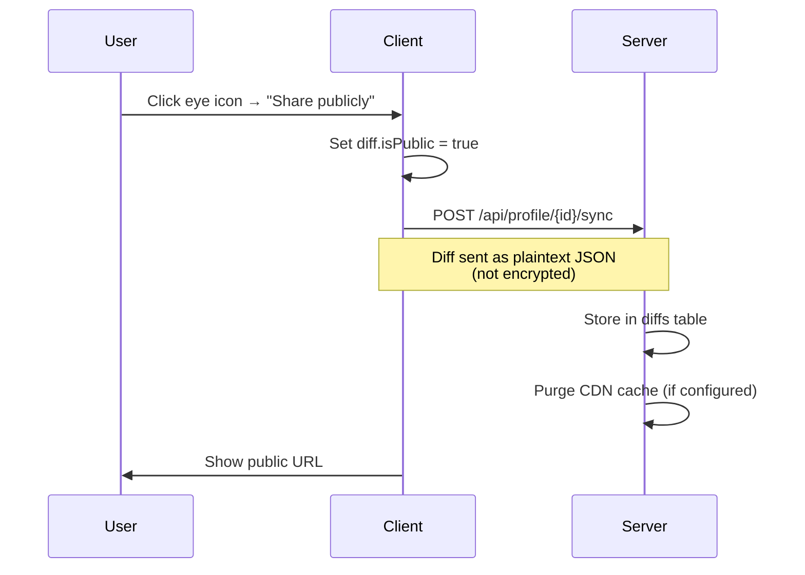
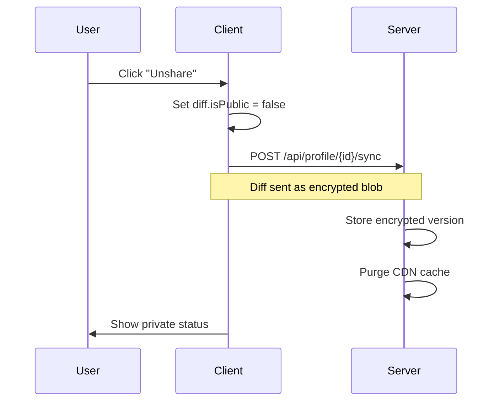

# Public Diff Sharing

Individual diffs can be shared publicly via a URL, allowing anyone to view a specific diff without authentication.

## Overview

| Aspect | Detail |
|--------|--------|
| **URL Format** | `/d?{diffId}` (e.g., `/d?abc123`) |
| **Requirement** | Profile must be synced |
| **Storage** | Plaintext JSON (not encrypted) |
| **Caching** | 24-hour CDN cache |

## How It Works

### Storage Format

Public and private diffs are distinguished by their storage format in the database:

```
Public diff:  {"content": "...", "title": "...", "generated_at": "..."}  (JSON)
Private diff: U2FsdGVkX1...base64...  (encrypted blob)
```

The server detects public diffs by checking if `encrypted_data` starts with `{`.

### Share Flow



### Unshare Flow



## UI

The share status is displayed with an eye icon in the diff header:

| Icon | State | Description |
|------|-------|-------------|
| 👁 (open) | Public | Anyone with the URL can view |
| 👁‍🗨 (closed) | Private | Only accessible via sync |

Clicking the icon opens a dropdown:

- **Private diff**: "Share publicly" button (requires active sync session)
- **Public diff**: Shows URL, copy button, and "Unshare" button

!!! note "Sync Required"
    The share dropdown only appears for synced profiles. Users must have an active sync password to modify share status.

## API

### `GET /api/diff/{id}/public`

Retrieve a public diff. Returns 404 for private diffs.

**Response (200):**
```json
{
  "id": "abc123",
  "content": "# Your Dev Digest\n\n...",
  "title": "Weekly Update",
  "generated_at": "2026-01-28T10:00:00Z",
  "profile_name": "Chris"
}
```

**Response (404):**
```json
{ "error": "Diff not found" }
```

**Cache Headers:**
```
Cache-Control: public, max-age=86400
Cache-Tag: diff-{id}
```

### Cache Invalidation

When a diff is modified or unshared, the server purges the CDN cache using Cloudflare's Cache Tag API. Requires `CF_ZONE_ID` and `CF_API_TOKEN` environment variables.

## Client Implementation

### Store Methods

```typescript
// Mark diff as public (triggers sync)
shareDiff(diffId: string): boolean

// Mark diff as private (triggers sync)
unshareDiff(diffId: string): boolean

// Check if diff is public
isDiffPublic(diffId: string): boolean

// Get shareable URL
getPublicDiffUrl(diffId: string): string  // → "https://difflog.app/d?{id}"
```

### Sync Serialization

During sync, diffs are serialized based on their `isPublic` flag:

```typescript
if (diff.isPublic) {
  // Store as plaintext JSON
  const { isPublic, ...diffData } = diff;
  encrypted_data = JSON.stringify(diffData);
} else {
  // Store as encrypted blob
  encrypted_data = await encryptData(diff, password, salt);
}
```

On download, the format is detected and `isPublic` is restored:

```typescript
if (encrypted_data.startsWith('{')) {
  diff = JSON.parse(encrypted_data);
  diff.isPublic = true;
} else {
  diff = await decryptData(encrypted_data, password, salt);
  diff.isPublic = false;
}
```

## Security Considerations

!!! warning "Public Content"
    Public diffs are **not encrypted**. The full diff content (markdown) is stored in plaintext and accessible to anyone with the URL.

- Diff IDs are UUIDs — not guessable, but not secret if shared
- Profile name is included in the public response
- API keys and other profile data remain encrypted
- Stars (bookmarks) are always encrypted
