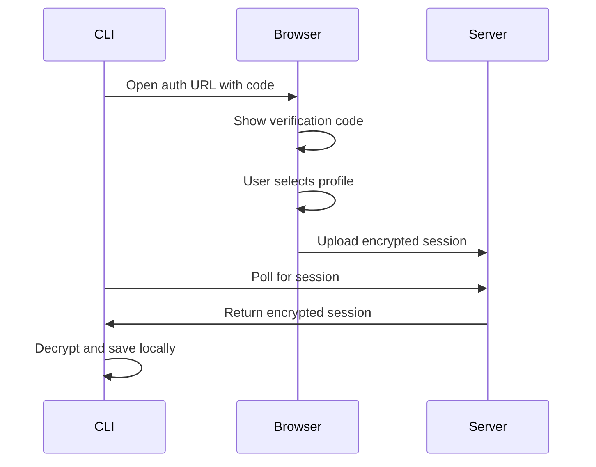

# CLI Usage

Access diff·log from your terminal without opening a browser. The CLI is built with Bun and shares the same codebase as the web app.

## Installation

### Download Binary

Download the latest release for your platform from [GitHub Releases](https://github.com/SmileyChris/difflog/releases):

```bash
# Linux (x64)
curl -L https://github.com/SmileyChris/difflog/releases/latest/download/difflog-linux-x64 -o difflog
chmod +x difflog
sudo mv difflog /usr/local/bin/

# macOS (Apple Silicon)
curl -L https://github.com/SmileyChris/difflog/releases/latest/download/difflog-darwin-arm64 -o difflog
chmod +x difflog
sudo mv difflog /usr/local/bin/

# macOS (Intel)
curl -L https://github.com/SmileyChris/difflog/releases/latest/download/difflog-darwin-x64 -o difflog
chmod +x difflog
sudo mv difflog /usr/local/bin/
```

### Build from Source

Requires [Bun](https://bun.sh) to be installed:

```bash
git clone https://github.com/SmileyChris/difflog.git
cd difflog
bun install
bun build:cli
```

The compiled binary will be at `./dist/difflog`.

## Authentication

### Web-Assisted Login (Recommended)

The easiest way to log in — just like `gh auth login`:

```bash
difflog login
```

This will:

1. Print a 4-character verification code
2. Open your browser to difflog.dev
3. Show the same verification code in the browser
4. Let you select a profile from your browser's saved profiles
5. Automatically sync your profile and diffs to the CLI

**Verification code example:**
```
$ difflog login

  Verification code: a3f7

  Press Enter to open difflog.dev in your browser...
```

In your browser, you'll see the same code `a3f7`. If they match, click "Codes match" and select your profile.

!!! tip "No browser on this device?"
    Use `difflog login --no-browser` to print the URL instead of auto-opening. Copy the URL to a device that has your profile saved.

!!! info "QR Code Fallback"
    If you don't have any profiles on the current device, the browser will show a QR code. Scan it with a phone/tablet that has your difflog profile.

### Direct Login (Advanced)

If you know your profile ID and password, you can log in directly:

```bash
difflog login --profile YOUR_PROFILE_ID --password YOUR_PASSWORD
```

This bypasses the browser and authenticates directly with the difflog API. Useful for:

- Automated scripts and CI/CD
- Headless servers
- Environments without a browser

!!! warning "Shared Profiles Only"
    Direct login requires a shared profile with a sync password. Local-only profiles don't have passwords and must use web-assisted login.

## Quick Start

Once installed, just run:

```bash
difflog
```

**First time?** You'll be prompted to log in via your browser.

**Already logged in?** You'll see your most recent diff.

That's it. Zero friction.

---

## Commands

### `difflog` (no arguments)

**Smart default command** — the fastest way to use difflog.

**Behavior:**

- **Not logged in?** → Automatically starts the login flow
- **Logged in?** → Shows your most recent diff

**Examples:**

```bash
# First time: logs you in
difflog

# After login: shows latest diff
difflog

# Pipe to a markdown reader
difflog | glow -
```

### `difflog login`

Authenticate with difflog.

**Options:**

- `--no-browser` - Print URL instead of auto-opening browser
- `--profile ID` - Profile ID for direct login
- `--password PWD` - Password for direct login

**Examples:**

```bash
# Interactive web login
difflog login

# Print URL without opening browser
difflog login --no-browser

# Direct login (shared profiles only)
difflog login --profile abc123... --password mypassword
```

### `difflog ls`

List your diff history.

```bash
$ difflog ls

2026-02-12  Next.js 15.1, Bun 1.2, React 19 patterns
2026-02-10  TypeScript 5.7, Deno 2.0, Vite 6.0
2026-02-08  SvelteKit 3.0, Astro 5.0, Tailwind 4.0
```

**Options:**

- `--limit N` - Show only the N most recent diffs (default: 10)
- `--json` - Output as JSON for piping to `jq`

### `difflog show <id>`

Read a specific diff in the terminal.

```bash
difflog show <id>
```

**Output:**

- Renders markdown with ANSI colors
- Detects dark/light terminal theme
- Linkifies URLs (supports OSC 8 where available)

**Examples:**

```bash
# Show a specific diff
difflog show 2026-02-12

# Pipe to a pager
difflog show 2026-02-12 | less -R

# Pipe to a markdown reader
difflog show 2026-02-12 | glow -
```

### `difflog gen` _(Coming Soon)_

Generate a new diff directly from the terminal.

```bash
difflog gen
difflog gen --focus "TypeScript"
difflog gen --deep
```

This will run the full AI pipeline (fetch feeds, curate, search, synthesize) using your profile settings and cached API keys.

### `difflog config` _(Coming Soon)_

View and edit your profile from the CLI.

```bash
# View current profile
difflog config

# Edit profile
difflog config --edit
```

## How It Works

The CLI uses the same encryption and sync system as the web app:

1. **Local-first storage**: Profile and diffs stored in `~/.config/difflog/` (or OS equivalent)
2. **Client-side encryption**: All synced data is encrypted with your password
3. **Shared codebase**: Uses the same TypeScript code as the web app, compiled to a standalone binary

### Web Login Flow



The server never sees your plaintext credentials. The session data is encrypted in the browser using the auth code as a key, stored temporarily in Cloudflare KV, and deleted after the CLI retrieves it.

## Configuration

The CLI stores data in standard OS locations:

| Platform | Location |
|----------|----------|
| Linux | `~/.config/difflog/` |
| macOS | `~/Library/Application Support/difflog/` |
| Windows | `%APPDATA%\difflog\` |

**Files:**

- `session.json` - Authentication credentials
- `profile.json` - Profile metadata (name, languages, frameworks, etc.)
- `diffs.json` - Cached diff history

## Tips & Tricks

### Pipe to Markdown Readers

The CLI outputs clean markdown. Pipe it to your favorite reader:

```bash
# glow
difflog show latest | glow -

# bat
difflog show latest | bat -l md

# mdcat
difflog show latest | mdcat
```

### JSON Output

Use `--json` for scripting:

```bash
# Get the 3 most recent diff IDs
difflog ls --limit 3 --json | jq -r '.[].id'

# Count diffs by month
difflog ls --json | jq -r '.[].generated_at' | cut -d- -f1-2 | uniq -c
```

### Aliases

Add shortcuts to your `.bashrc` or `.zshrc`:

```bash
alias dl='difflog'
alias dls='difflog show'
alias dll='difflog ls'
```

### CI/CD Integration

Use direct login in CI pipelines:

```bash
#!/bin/bash
difflog login --profile "$DIFFLOG_PROFILE_ID" --password "$DIFFLOG_PASSWORD"
difflog show latest > CHANGELOG.md
```

Store credentials as secrets in GitHub Actions, GitLab CI, etc.

## Troubleshooting

### Login timeout

**Problem:** `Error: Login timed out. Run 'difflog login' to try again.`

**Solution:** The auth code expires in 5 minutes. Run `difflog login` again and complete the browser flow faster.

### Connection failed

**Problem:** `Error: Unable to connect to https://difflog.dev`

**Solution:**

- Check your internet connection
- Verify you're not behind a restrictive firewall
- Try using a VPN if your network blocks the domain

### Verification code mismatch

**Problem:** The code in the terminal doesn't match the browser.

**Solution:** This indicates a potential security issue. Close the browser tab, press Ctrl+C to cancel the CLI, and run `difflog login` again. If the problem persists, report it as a bug.

### No profiles found

**Problem:** Browser shows "No profiles found on this device."

**Solution:**

- Create a profile at [difflog.dev/setup](https://difflog.dev/setup)
- Or scan the QR code on a device that already has your profile
- Or use `difflog login --profile ID --password PWD` for direct login (shared profiles only)

## FAQ

**Q: Do I need to be logged in to the website to use the CLI?**

No. The CLI stores your profile and diffs locally. Once you've run `difflog login`, the CLI works offline for reading cached diffs.

**Q: Can I use the CLI with a local-only profile?**

Yes, via web-assisted login. The browser will send your local profile data to the CLI. Direct login (`--profile`/`--password`) only works with shared profiles.

**Q: Is my data encrypted?**

Yes. Shared profiles use the same client-side encryption as the web app. Local profiles are stored as plaintext on disk (same as browser localStorage).

**Q: Can I use multiple profiles?**

Not yet. The CLI currently supports one active profile. Run `difflog login` again to switch profiles.

**Q: How do I log out?**

Delete the session file:

```bash
# Linux/macOS
rm ~/.config/difflog/session.json

# Windows
del %APPDATA%\difflog\session.json
```

**Q: How big is the binary?**

About 90 MB. It's a standalone Bun executable with the JavaScript runtime bundled. No external dependencies required.

## Roadmap

See [CLI Interface](future/cli.md) for planned features:

- [x] `difflog login` - Web-assisted authentication
- [x] `difflog ls` - List diffs
- [x] `difflog show` - Read diffs
- [ ] `difflog gen` - Generate new diffs
- [ ] `difflog config` - Edit profile from CLI
- [ ] `difflog summary` - Plain text summaries for scripts
- [ ] `--json` output on all commands
